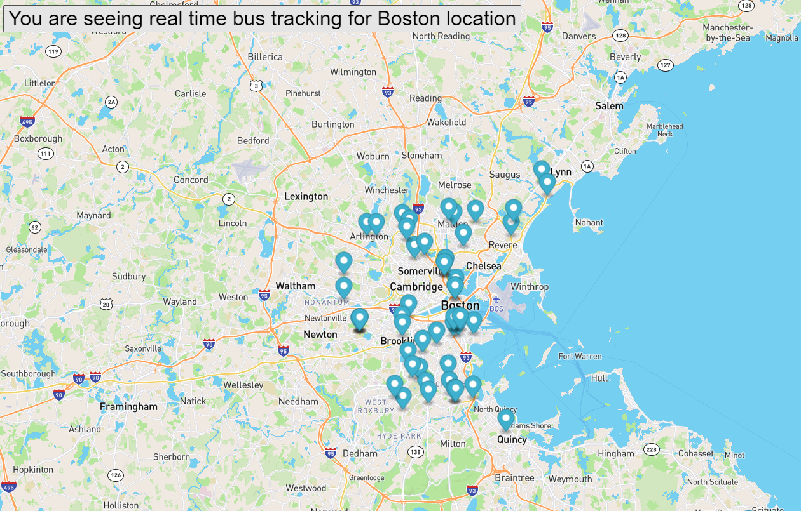

# Name: BusTracker

## Description: 
BusTracker is a project to demonstrate my JavaScript, API, & html skills. In this project, the all the buses in boston area are tracked in real time. The project is created using the MBTA API's. 

## Installation: 
1. Download the project to your desktop. If zipped, unzip it. 
2. Open index.html file in a browser to see the bouncing of the ball. 

## Usage: 
Use this project to play with JavaScript features and to improve your API and JSON skills.

## Support: 
There are many support portals available for JavaScript like MDN, StackOverflow, etc. You can use this forum to research various styles and ask questions.

## Roadmap: 
The future enhancements will include color coding to identify the unique buses and add zoom control to the map. 

## License information: 

See MIT license release in repository.
